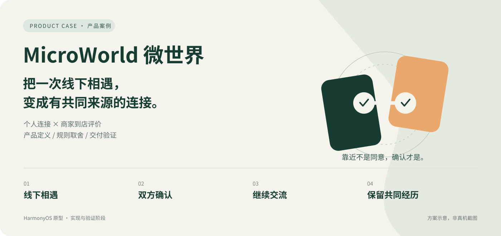

# MicroWorld 微世界

把一次线下相遇，变成有共同来源、经双方确认的连接。



HarmonyOS 原生 App 原型 · 独立产品项目 · 实现与验证阶段

## 项目解决什么问题

在线下兴趣活动中，认识一个人之后，如何保留相遇来源并继续交流？MicroWorld 以 NFC「碰一碰」作为入口，探索个人关系建立与商家到店评价两类场景。目标用户与需求仍是假设，尚无已核验的用户增长、留存或商业化结果。

我的工作覆盖产品定义、流程与规则设计、优先级管理、技术可行性评估和交付验收。重点不是功能数量，而是把确认、取消、失败重试、评价资格和奖励边界定义清楚。

## 核心体验


- **个人连接：** NFC 交换 → 双方确认 → 建立好友及聊天 → 保留碰面记录。首次与复次碰面均需确认。
- **商家到店：** 登记终端交换 → 消费者确认 → 打卡 → 地点评价 → 按规则领取奖励。真实支付和商品评价未开放。

NFC 客户端交互记录不等于不可伪造的到场证明；目前不声称硬件认证、GPS 核验或防中继已完成。

## 三个关键产品判断

1. **靠近不是同意：** 物理接触不替代社交授权，保留双方确认与取消。
2. **到店不是购买：** 分离地点评价与商品评价；没有支付核验就不开放购买评价。
3. **重试不是重做：** 网络中断后优先查询原结果，不重复建立关系或发放奖励。

[阅读完整案例](portfolio/case-study.md) · [查看取舍与理由](portfolio/decisions.md)

## 当前交付与验证边界

| 范围 | 当前状态 |
|---|---|
| 注册登录、会话、聊天、个人/商家 NFC 业务规则 | 有代码与自动回归；完整真机体验仍待验收 |
| 数据库与部署准备 | PostgreSQL 16、TLS、故障恢复、备份恢复及容器验收有 CI 记录；未部署华为云 |
| 自动测试 | 本轮 82 项后端测试通过（含 3 项本地配置回归）；属于工程证据，不是用户价值指标 |
| 地图 | 接入 MapKit 组件，当前使用示例坐标；真机出图与真实位置未验收 |
| 数字纪念凭证 | 默认未上链凭证；真实 BCS 铸造未验收 |
| 支付、AR、AI 导游 | 支付关闭；AR/AI 保留原型或暂缓入口，不作为已交付能力 |

[核对验收证据与运行记录](portfolio/evidence.md)。历史流程图是设计资料，不代表其中所有能力已经可用。

## 产品作品集

- [产品案例首页](portfolio/README.md)：面向招聘者的快速阅读入口。
- [核心 PRD](portfolio/prd.md)：流程、规则、异常与验收标准。
- [90 秒演示分镜](portfolio/demo.md)：录制脚本，尚非真机视频。
- [用户验证计划](portfolio/validation.md)：任务、指标与访谈模板，尚无实际研究结果。
- [迭代复盘](portfolio/iteration-review.md)：需求取舍、实现问题及下一步验证。

## 运行与代码

后端建议使用 Node.js 22；依赖按锁文件安装：

```bash
cd backend
npm ci
npm run start:example
```

该命令读取无秘密的 `.env.example`，默认仅监听电脑本机，文件模式保存到 `backend/data.json`。不要用示例配置运行生产业务。已有环境变量优先于示例文件，详见 [本地调试与配置安全](docs/LOCAL_DEMO_SETUP.md)。

前端用 DevEco Studio 打开项目，按自己的账号与设备配置签名。手机的 `127.0.0.1` 不是电脑；真机连接需单独配置网络地址。签名、AGC 配置和云凭据不随展示材料提供。

- 前端主页面：[Index.ets](entry/src/main/ets/pages/Index.ets)
- 后端模块与接口：[后端文档](backend/README.md)
- 构建及逐阶段验证：[验收记录](docs/IMPLEMENTATION_ACCEPTANCE.md)

当前展示不改变仓库访问权限。公开仓库前须检查已有 Git 历史中的签名与秘密，新增忽略规则无法清理历史记录。
