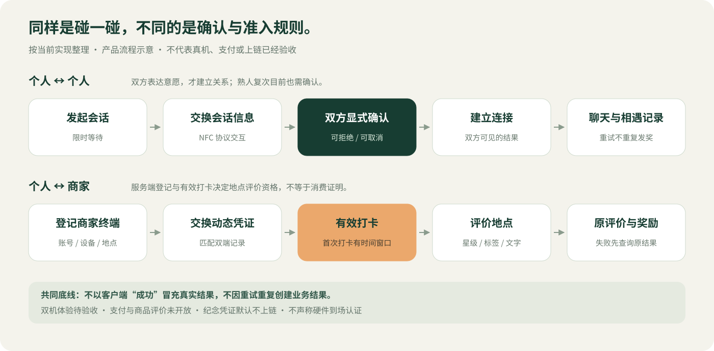

# 产品演示｜90 秒讲清核心价值

[返回展示首页](README.md)

**当前交付：可用于讲解的流程视觉与完整录制脚本。尚无真机录屏成片。** 不用流程动画、原型跳转或接口模拟替代双机实测。

## 先看两条业务路径

重点不在于“手机碰一下很酷”，而在于碰触之后的意愿确认、结果归属和失败恢复。个人与商家不是同一套关系：前者是双方社交同意，后者是登记终端与评价资格。

## 90 秒视频分镜与讲解稿

| 时间 | 画面要求 | 讲解内容 | 素材状态 |
|---|---|---|---|
| 0–10 秒 | 产品封面；不展示未经核验的用户数据 | “MicroWorld 探索的是：一次线下相遇结束后，如何把共同经历延续成双方愿意保留的连接。” | 封面已提供 |
| 10–25 秒 | 流程示意，突出双方确认 | “个人链路不是碰到就自动加好友。两个人都明确确认，才建立连接，并保留本次来源。” | 流程图已提供 |
| 25–45 秒 | 两部真机从等待、读取、双方确认到同一聊天；保留真实等待过程 | “我把首次和复次碰面都保留为双方确认，先确保意愿与恢复边界清楚，再考虑减少步骤。” | 真机录制待完成 |
| 45–60 秒 | 登记商家终端 → 打卡 → 地点评价 → 原结果 | “商家链路区分到店和购买。当前可以验证到店评价相关规则，真实支付没接入，所以商品评价保持关闭。” | 真机录制待完成；可先使用带标注的流程图讲解 |
| 60–75 秒 | 演示一次断网或重复提交后查询原结果；无法实测时展示验收记录 | “网络失败不一定等于操作失败，所以恢复时查原结果，不重新发放奖励。” | 自动验收记录已有；真实异常录屏待完成 |
| 75–90 秒 | 已实现/待验证清单 | “代码与可靠性验收已有记录，但用户价值、双机体验和真实外部服务仍要继续验证。下一步是让目标用户完成核心任务。” | 状态清单已提供 |

## 录制前检查

1. 使用专门测试账号；隐藏邮箱、安装标识、令牌、证书、位置细节、真实聊天及他人头像。
2. 两部支持对应能力的鸿蒙真机连接同一测试后端。商家演示账号/设备必须预先登记，不为拍视频临时放宽服务端条件。
3. 记录 App 构建版本、提交号、设备型号、系统版本、测试日期与网络条件。
4. 明确每段的素材性质：真机、原型、流程示意或自动测试。剪辑不能删除失败后改用模拟成功，却仍称端到端实录。
5. 支付入口如未开放就展示未开放，不制作伪收款成功画面；纪念凭证不加“已上链”标记。

## 成片验收要求

- 观众无需安装开发工具即可理解用户、场景与核心规则。
- 至少有一条不依赖剪辑伪造连续性的真实核心链路；若没有，视频标题必须写“产品方案讲解”，不能写“真机完整演示”。
- 真机截图与视频应记录版本，不能用旧设计稿证明当前界面已修复。
- 所有展示数字标注来源。界面演示积分不作为真实运营成绩。

## 当前不能补造的素材

当前没有连接可录制的设备，也没有可核验的访谈记录。因此本次没有生成“真机实测视频”“用户好评截图”或“增长曲线”。素材齐备后可按上述脚本补录；保存规范见 [media/README.md](media/README.md)。
